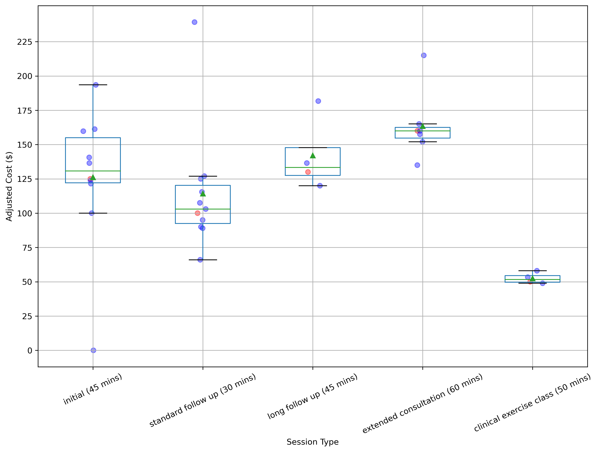

# Boxplot of local physiotherapist Fees

A simple script used to generate a boxplot comparing the fees of nearby
physiotherapists in order to inform pricing decisions. Pricing was standardised
by calculating fee per min (`$/min`) and applied to standard common times for
each appointment type.

